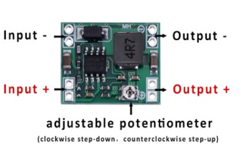
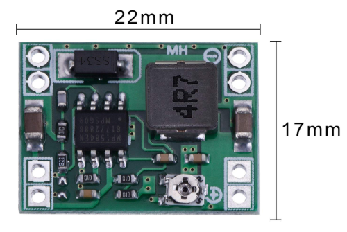
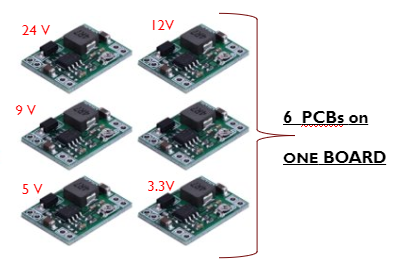
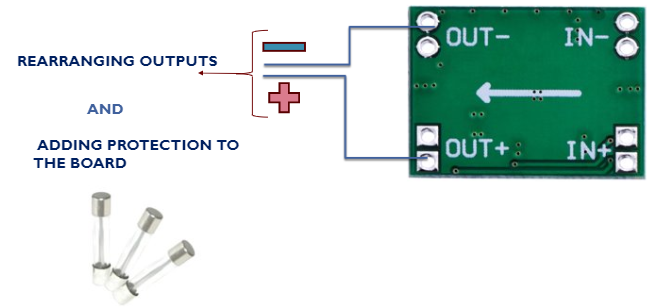
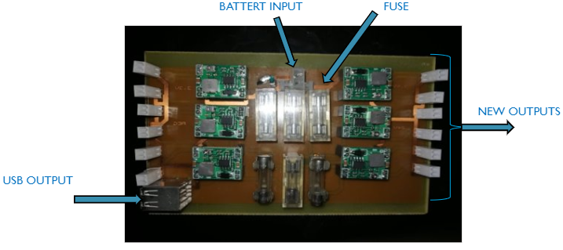

# Power supply board

This PCB is consisted of six pieces of   DC-DC Power Supply Adjustable Step Down Module with an adjustable potentiometer to fix the value of the voltage wanted (24V 12V 9V 5V 3V).

    Those are Mini MP1584EN DC DC buck converter step-down module with a wide range of:
    • Input voltage: 4.5V to 28V
    • Output voltage: 0.8 V to 20 V
    • Output current: 3 (maximum)
    •  Conversion efficiency: 92% (maximum)
    • Output ripple: less than 30 mV
    • Switching frequency: 1.5 MHz (higher), usually 1 MHz
    • Operating temperature: -45 ℃ to 85 ℃; 
    • Size: 22 mm by 17 mm by 4 mm

## Warning:
    • Do not reverse the positive and negative terminals to avoid possible damage.
    • Do not use a light load (less than 10% power output) or no load

    The Purpose of the creation of this board is to realize a better power supply board by:
    • Gathering all those 6 pieces on one board with different output voltage

    • Rearranging their outputs in such a way the + and the – become side by side so it is easier to be plugged by the user. Also creating an USB port output for the Arduino.
    • Adding protection to the Board using fuses at the entrance of each PCB (the fuses must be with different values depending on the value putted on the potentiometer).

## 3D PCB

This is the final power supply board with its new outputs including USB port output and its protection:

## IMPROVEMENT
    For better protection to our power supply board we can improve our protection by adding a freewheeling diode to protect the board in case  the battery terminals are inverted.
