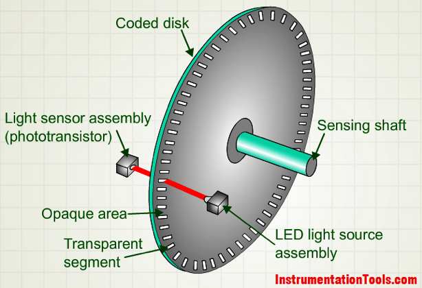
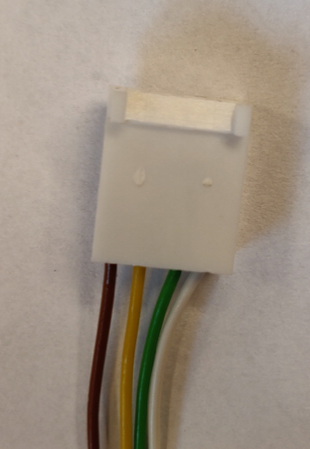
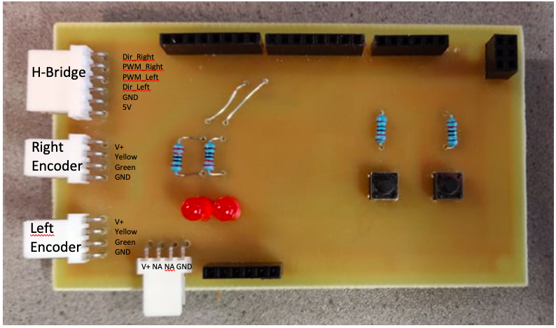

# Encoders
An incremental encoder delivers a certain number of pulses per revolution. The number of pulses is a measure for angular or linear movement. A fixed disc on a shaft is divided into transparent and opaque segments

Source : https://instrumentationtools.com/encoder-working-principle/

Most of them have two rows of segments (track A and track B) and a Top Z segment. The two tracks out of phase by 90° indicate the direction of rotation, while the top Z indicates the number of revolutions.

 

Their resolution is the maximum number of pulses it sends per turn, it is expressed in tick/tr (in the encoder that we use we have 4000 ticks/tr).

# Material:
Model: Baumer ITD 01 B14 Incremental Rotary Encoder

The datasheet of this encoder is avaible.

Color Assignment

Green --> Track A

Yellow --> Track B

Brown --> V+

White --> GND

Transparent --> Shield/Housing

We decided to plug the wire on this way for all the encoders:

 
To facilitate the wiring, we made a PCB to connect the encoder to the Arduino Mega. Here the pin mapping of the encoders:

Right Encoder: green (track A) --> pin 2
               yellow (track B) --> pin 3
Left Encoder: green (track A) --> pin 19
              yellow (track B) --> pin 18
# Shield
On the shield we have two connectors for the encoders, one connector to plug with the H-bridge and one that can be connected to the battery in case the Arduino is not connected by USB cable to the Raspberry.

We also soldered two LEDs that allow us to verify that the encoders move the code and perform the position calculation.

You can see how we connect the shield to the H-bridge. 

Warning!! This documentation is only for the new version of the PCB not the old one!
